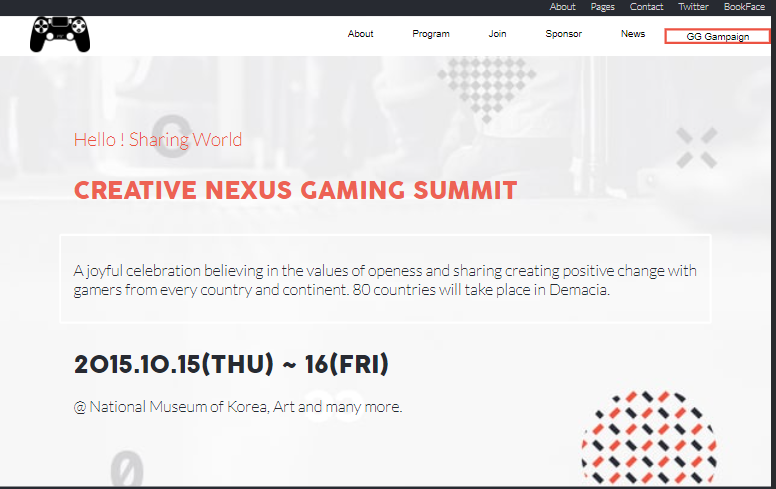

# GAMERS NEXUS Event Web Page

> GG NEXUS gaming event of the year, featuring multiple speakers from across the gaming world

## Built With

- HTML
- CSS
- Javascript
- Markdown

## Live Demo (if available)

[Live Demo Link](https://tinatsina.github.io/)

## Getting Started

**Set up a linter for HTML, CSS and JS**

To get a local copy up and running follow these simple example steps.

1. Clone this repository or download the Zip folder:

**``git clone https://github.com/tinatsina/tinatsina-capstone.git``**

1. Navigate to the location of the folder in your machine:

**``you@your-Pc-name:~$ cd <folder>``**

**Git**
**Node JS (preferably any LTS version) for linters**

## Author

👤 **Tinaye Hamufari Tsinakwadi**

> Aspiring web developer mainly interested in minimal code. Research interests include Database design and IOT.

- [GitHub](https://github.com/tinatsina)
- [Twitter](https://twitter.com/TinayeT)
- [LinkedIn](https://www.linkedin.com/in/tinayetsina/)

Please feel free to contact me anytime

## Show your support

Give a ⭐️ if you like this project!

## Acknowledgments

- Hat tip to Microverse

## 📝 License

- This project is [Creative Commons Licensed](./MIT.md) licensed.
- [Cindy Shin in Behance](https://creativecommons.org/licenses/by-nc/4.0/)
